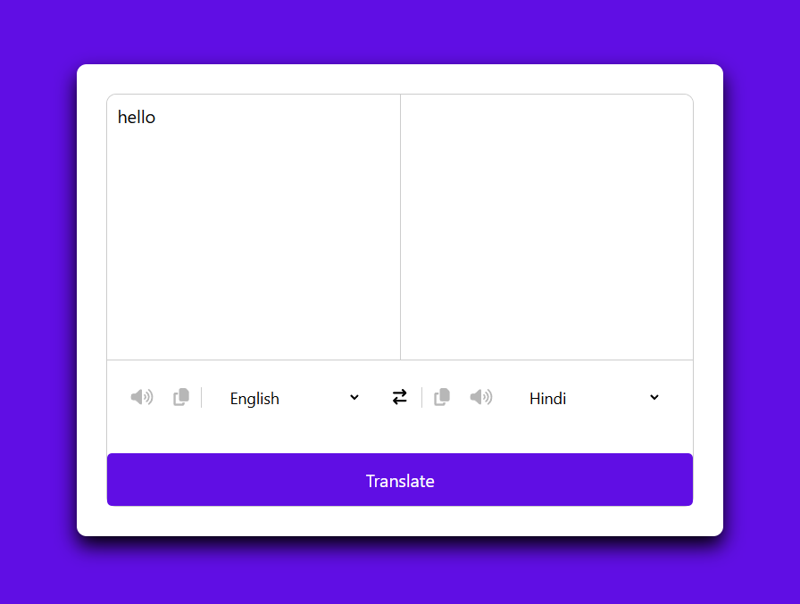

# 🌍 Language Translator

A simple and responsive **Language Translator** built with **React.js** that allows users to translate text between multiple languages.

---

## 🚀 Features
✅ Translate text between over **100 languages**  
✅ Clean and modern UI  
✅ Real-time translation  
✅ Fast and responsive design  

---

## 🛠️ Installation

1. **Clone the repository**  
```bash
git clone https://github.com/akashprajpaticsc/language-translator.git
```

2. **Navigate to the project directory**  
```bash
cd language-translator
```

3. **Install dependencies**  
```bash
npm install
```

4. **Start the development server**  
```bash
npm start
```

---

## 📂 Project Structure
```
language-translator/
├── public/
│   └── index.html
├── src/
│   ├── components/
│   │   ├── App.js
│   │   ├── App.css
│   │   ├── languages.js
│   │   ├── index.js
│   │   └── reportWebVitals.js
│   ├── index.css
├── .gitignore
├── package.json
├── package-lock.json
└── README.md
```

---

## 🏆 Usage
1. Open the app in your browser.  
2. Type text in the input box.  
3. Select the source and target language from the dropdown.  
4. Click the **Translate** button to get the translation instantly.  

---

## 🌟 Technologies Used
- **React.js**  
- **JavaScript**  
- **HTML**  
- **CSS**  

---

## 🌄 **Screenshot**  
 

---

## 🤝 Contribution
Feel free to contribute by creating a pull request or opening an issue!  

---

## 📄 License
This project is licensed under the **MIT License**.  
